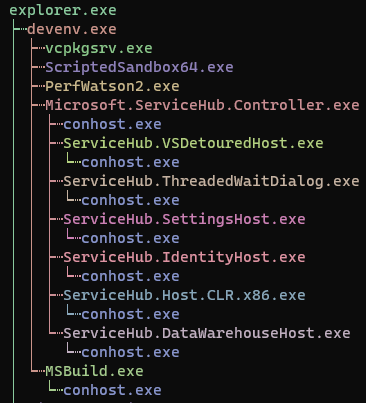

# processM
Console tool for manage processes with filters



## About
This project was created for Windows console users who want more control over their processes or easier to manage them. 

## Start

You can use path for first argument in console / terminal or place executable file to PATH directory or to %windir%/system32/ and use filename as argument

For get help use
```powershell
processm help
```
processm is filename from PATH directory